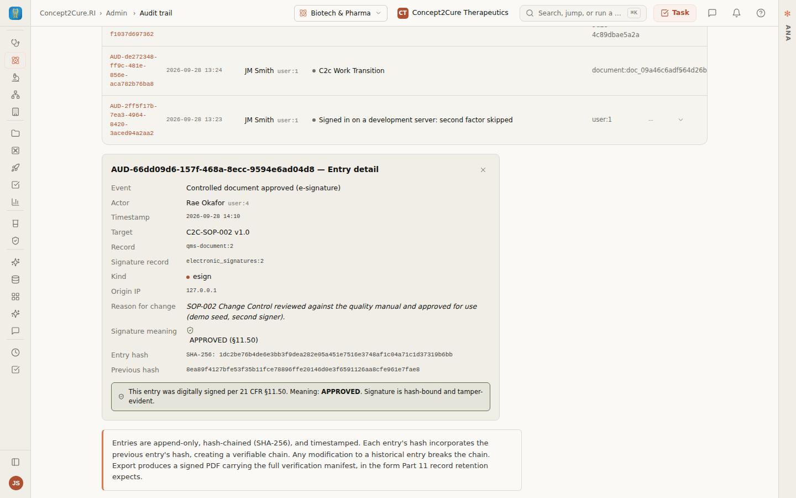

# D5 — a signed act reads as signed in the audit trail, linked to its signature (2026-09-28)

**Row:** D5 (Part 11 evidence). **Item:** #24, the remainder of launch-sweep
finding 53. It was seen in the two-signer run
(`../../W1/2026-09-28-populated/`): an SOP made effective by the second
signer's e-signature showed in the audit trail as "C2c Work Approve", unsigned,
with no meaning and no origin address.

## What was wrong

The ledger (`server/routes/audit-trail-ledger.routes.ts`) reported `sig: false` for
**every** `audit_logs` row, because that table has no signature-status column.
The signing ceremonies write their audit row and their signature row in one
transaction, and the signature row names the audit row, but nothing read that link:

- QMS approve and retire (`services/qms/document-approval-signature.ts`) write one
  `electronic_signatures` row. Its `signature_manifest.auditId` is the
  `audit_logs.id` of the same act.
- The authoring e-sign (`routes/authoring.router.ts`) writes an
  `authoring_signatures` row. Its audit row recorded the meaning but **not** which
  signature it was, so no link could be made at all.

On 2026-09-28, 196 ledger rows existed, 0 of them read as signed, and 3 were real e-signatures.

## What changed

- **Read side.** `linkedSignatures()` resolves, for each page of `audit_logs` rows,
  the signature row that names each one. It runs one query per store:
  - `electronic_signatures` by `manifest.auditId`, in the same organization;
  - `authoring_signatures` by the `signatureId` the audit row records, in the same
    organization and **for the same document**.

  A linked row reads `sig: true`, with the meaning the signature row records, the
  act named from the signature's own type ("Controlled document approved
  (e-signature)", "Document e-signed"), and the record named from the signature's
  own manifest or document ("C2C-SOP-001 v1.0", the document title).
  `targetRef` keeps the record's own reference and `signatureRef` names the
  signature row (§11.70), so the reader's name never replaces what an inspector
  traces by. Nothing is inferred from timing, actor or target: a row with no
  recorded link stays unsigned.
- **Write side.** The authoring e-sign audit row now records `signatureId`.
- **The same naming** is used by the admin console's audit band (`mdx-admin.ts`)
  and by a document's own audit history (`readRecordAuditHistory`).
- **Missing tables.** Absent stores are detected with `to_regclass`, not by catching
  `42P01`, because a failed statement would abort the ledger's transaction.
- **The surface.** The Audit trail drawer shows **Record** and **Signature record**,
  and search matches the record reference.

## Shown failing first

[`fail-before.txt`](fail-before.txt):

- Server, PGlite with the real chained writer: 3 of 13 fail on the previous ledger,
  and 13 of 13 pass on the fix. The three cases:
  - an SOP approval is linked;
  - a document e-sign is linked only for its own document;
  - nothing is claimed without a link, or from another organization's signature.
- Client: 2 of 3 fail on the previous surface (the drawer's references, and search
  by reference). The third passes both ways, because the table already drew the
  signed mark whenever `sig` was true.

## Live, on the running app

The C2C-101 demo organization. See [`ledger-after.json`](ledger-after.json) and the screenshots.

| Row | Before | After |
|---|---|---|
| SOP-001 approval (second signer, password re-auth) | "C2c Work Approve", unsigned, meaning none, target `qms-document:1`, no IP | "Controlled document approved (e-signature)", **signed**, APPROVED, "C2C-SOP-001 v1.0", record `qms-document:1`, signature `electronic_signatures:1`, IP from the signature |
| SOP-002 approval | same | same, `electronic_signatures:2` |
| Module 2.5 Clinical Overview, e-signed live today by the second signer through `POST /api/authoring/docs/:id/e-sign` | (new) | "Document e-signed", **signed**, REVIEWER, titled, `authoring_signatures:3655cff7-…` (the id the route returned) |
| Protocol Synopsis e-sign from the earlier run | unsigned | **still unsigned**. Its audit row was written before the link was recorded, and a link is not guessed |

The hash chain verifies before and after (197 of 197 rows), because reading changes nothing.

## Also fixed in this change

`projects-detail-taxonomy.test.ts` expected a new program's readiness to be `0`.
`7196d63d1` (this session, earlier) made "nothing to measure" read as "not
measured" (`null`), deliberately. That test predates the change and failed from
that push until this one. It now expects `null`, with the reason. The full
`client/src/concept2cure` and `server/routes` run surfaced it: 785 files, 8,059
tests, this 1 failure, now 0.

## Gates

- `tsc`: 0 errors.
- ESLint ratchet: no file gained a warning. `linkedSignatures` was split per store,
  and the admin band's target naming was extracted.
- `ci:server-error-leaks`, `ci:tenant-isolation`, `ci:check-test-imports`,
  `ci:untracked-imports` and `ci:db-test-isolation`: OK.
